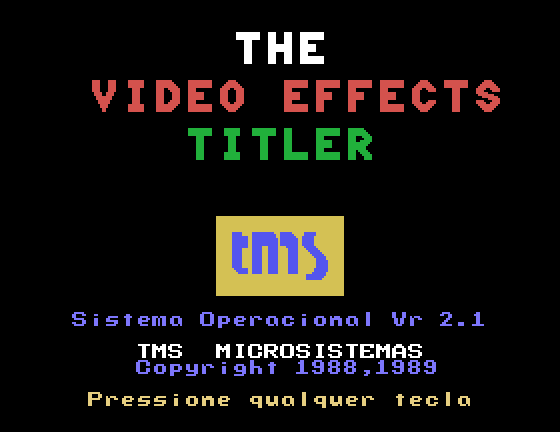

# VET 3000 — engenharia reversa e cartucho de demonstração

O **VET 3000 "The Video Effects Titler"** é um titulador de vídeo brasileiro fabricado pela
**TMS – Tecnologia em Micro Sistemas** (firmware © 1988, 1989). Por dentro, ele é um microcomputador:
CPU **Motorola MC6809**, processador de vídeo **Texas TMS9128** (família do TMS9918 usado no MSX 1 e
no ColecoVision), 16 KB de VRAM, 8 KB de RAM estática com bateria e 16 KB de ROM. O projeto deriva
do **Video Titler** publicado na revista americana *Radio-Electronics* em 1985-1986, vendido nos
EUA como **MFJ-1480B "Video Effects Titler (VET)"**.

Este repositório reúne tudo o que foi levantado sobre o aparelho:

- **Hardware:** fotos da placa, lista de componentes, mapa de memória, pinagem do conector
  traseiro CN1 e matriz do teclado.
- **Firmware v2.1:** *disassembly* completo e comentado, que **remonta byte a byte idêntico** à EPROM
  original.
- **Interface de cartucho:** o firmware procura cartuchos `"OBJECT"` e `"FONT"` no conector
  traseiro durante o boot. Aqui está documentado como escrever programas para ele.
- **Cartucho de demonstração**, com abertura animada e o jogo **QUEBRA-TIJOLO**, testado no MAME.
- **Placa do cartucho** em KiCad 10 (esquemático, placa roteada com Freerouting, Gerbers prontos),
  com EPROM 27C128 e soquete de borda para o CN1.
- **Ferramentas:** disassembler 6809 com rastreamento, script Lua que simula o cartucho no MAME sem
  recompilá-lo, e um patch para o driver do MAME.

| Titulador original (MAME) | Demo: abertura | Demo: jogo |
|---|---|---|
|  |  |  |

## Principais descobertas

- **Origem:** o VET 3000 é uma versão do "Build This Video Titler", de Jack Flack
  (*Radio-Electronics*, 11/1985 a 03/1986), que a MFJ vendia como MFJ-1480B. Coincidem os CIs, o
  mapa de memória, a decodificação, a ordem dos pinos do CN1, o teclado, os registradores do VDP, os
  comandos, a abertura e a fonte. O esquema da revista explica a parte analógica e o PLL que gera o
  clock de 10,738635 MHz do VDP. O CI raspado U19 é um processador de croma CA3126 (confirmado pelas ligações). Ver
  [docs/origem.md](docs/origem.md).
- **Memória:** RAM em `$0000-$1FFF` (8 KB — a HY6264 tem 64 Kbit), cartucho em `$4000-$7FFF`,
  E/S em `$8000-$8002` e ROM em `$C000-$FFFF`. Detalhes em [docs/mapa-de-memoria.md](docs/mapa-de-memoria.md).
- **Boot automático de cartucho:** no boot, a ROM compara `"OBJECT"` em `$4000` (e depois em `$6000`)
  e executa `LDX [base+6]` / `JSR base,X`. Como o indireto lê duas vezes, `base+6` precisa conter um
  *ponteiro* para a palavra com o deslocamento da entrada. Cartuchos `"FONT"` substituem as fontes.
  Ver [docs/programando-cartuchos.md](docs/programando-cartuchos.md).
- **Uso da RAM:** o firmware nunca habilita interrupções. Os vetores de IRQ/SWI apontam para RAM
  (`$0039/$003B/$003D`) e existem só para os cartuchos. Os títulos ficam em `$00A0-$018F` e
  `$0200-$1FFF` (30 páginas); um cartucho pode rodar sem apagá-los.
- **Sem interrupção de quadro:** o `/INT` do VDP não está ligado ao `/IRQ` do 6809 (medido). Para
  sincronizar com o quadro, é preciso ler o status do VDP em laço. O MAME liga os dois, então um
  programa que dependa dessa interrupção roda no emulador e trava no aparelho.
- **Código enxuto:** o código ocupa só cerca de 4,5 KB. O resto da ROM são três fontes (16×24, 8×24 e
  8×8), sprites e o logotipo. Há **3,2 KB livres** na EPROM.
- **Tecla "C" amarela:** não tem função no firmware v2.1 (a coluna dos modificadores só é lida nas
  linhas 1, 2 e 7, e o "C" amarelo fica na linha 6).
- **Bug no MAME 0.289:** o driver `vet3000` usa 3,58 MHz como clock do TMS9128. A tela roda a **20 Hz**
  em vez de 60 Hz. Há um patch em [mame/](mame/).

## Estrutura

```
docs/                 documentação (hardware, origem, memória, CN1, teclado, firmware, cartuchos, MAME)
  img/                fotos reduzidas, fontes extraídas da ROM e capturas de tela
  medidas-originais/  anotações originais da pinagem do CN1 e do teclado
photos/               fotos originais em alta resolução
rom/                  dump da EPROM 27128 (VET 2.1), preservado como material histórico
jogar_no_mame.bat     roda a demo no MAME (Windows)
disasm/               disassembly comentado (vet3000_v2.1.asm), anotações (hints.py), cobertura
tools/                dis6809.py, m6809.py, render_rom_gfx.py, show.py; mame/ (script Lua do cartucho)
cartridge/demo/       fonte do cartucho de demonstração (asm6809) e imagem pronta para a EPROM
mame/                 patch do driver vet3000 (slot de cartucho + clock correto do VDP)
hardware/cartucho/    projeto KiCad do cartucho (EPROM 27C128), Gerbers e scripts geradores
```

## Uso rápido

Requisitos: Python 3 (com Pillow para as imagens) e o [asm6809](https://www.6809.org.uk/asm6809/).

**Conferir o disassembly** (gera o `.asm` e remonta; o resultado tem que ser idêntico à ROM):

```bash
python tools/dis6809.py rom/VET2.1-TMS_VET3000_27128A.BIN --hints disasm/hints.py -o disasm/vet3000_v2.1.asm
asm6809 -B -o /tmp/vet.bin disasm/vet3000_v2.1.asm && cmp /tmp/vet.bin rom/VET2.1-TMS_VET3000_27128A.BIN
```

**Montar o cartucho** (gera `build/vet3000_demo.bin`, com 16 KB, para uma EPROM 27128):

```bash
cd cartridge/demo && ./build.sh          # ou .\build.ps1 no Windows
```

**Rodar no MAME**, sem recompilar: o script Lua simula o cartucho no conector CN1. No Windows,
basta dar dois cliques em **`jogar_no_mame.bat`**. Ele prefere o build corrigido em
`../mame-build/vet.exe`, quando disponível, para rodar a aproximadamente 60 Hz.
Isso reduz os saltos da raquete de 9 para 3 pixels por quadro, mantendo a velocidade.
Para escolher outro MAME, passe o caminho como argumento ou defina a variável `MAME`.
Sem o build local, usa o caminho padrão configurado no `.bat`. O `.bat` chama:

```powershell
.\tools\mame\run_cart.ps1 -Mame C:\mame\mame.exe -Cart cartridge\demo\vet3000_demo.bin
```

Controles da demo: **ESPAÇO** joga, **Z/X** (ou O/P, ou ←→ com e sem SHIFT) movem a raquete,
**RETURN** pausa, **V** sobrepõe ao vídeo externo e **EXT MODE** volta ao titulador. Segurar
**EXT MODE** ao ligar pula o cartucho. No editor do titulador, **SHIFT+EXT MODE** volta à demo.

## Documentação

1. [Hardware](docs/hardware.md): placa, componentes, clocks, vídeo, fonte
2. [Origem](docs/origem.md): o Video Titler da *Radio-Electronics* e o MFJ-1480B, comparação completa
3. [Mapa de memória](docs/mapa-de-memoria.md): CPU, E/S, VRAM, variáveis de RAM, ROM
4. [Conector CN1 e cartucho](docs/conector-cn1.md): pinagem e circuito de um cartucho com 27C128
5. [Teclado](docs/teclado.md): matriz, códigos, modificadores, leitura por software
6. [Firmware v2.1](docs/firmware.md): boot, laço principal, comandos, conjunto de caracteres, fontes
7. [Programando cartuchos](docs/programando-cartuchos.md): cabeçalho, regras de RAM, temporização do VDP
8. [MAME](docs/mame.md): como rodar, script Lua, bugs encontrados e patch do driver
9. [Cartucho de demonstração](cartridge/demo/README.md): técnicas, orçamento de ciclos, controles
10. [Placa do cartucho (KiCad)](hardware/cartucho/README.md): circuito, jumpers, montagem, fabricação

## Licença

Copyright © 2026 **Leonardo Roman da Rosa**.

Ferramentas, anotações do disassembly, documentação e o cartucho de demonstração são software livre
sob a **GNU General Public License versão 3** ou (a seu critério) qualquer versão posterior. Veja
[LICENSE](LICENSE).

O projeto de hardware do cartucho ([hardware/cartucho](hardware/cartucho/)) é hardware aberto sob a
**CERN-OHL-S-2.0** ([hardware/cartucho/LICENSE](hardware/cartucho/LICENSE)).

O firmware original (a imagem em `rom/` e o código e os dados reproduzidos no disassembly) é
© 1988, 1989 TMS – Tecnologia em Micro Sistemas. A empresa não existe mais, e o dump, extraído de um
aparelho real, está incluído como **material histórico, para preservação e estudo**. Ele não é
coberto pela GPL. VET 3000 e TMS são marcas dos respectivos donos. O patch do MAME segue a licença do
MAME (GPL-2.0+).
