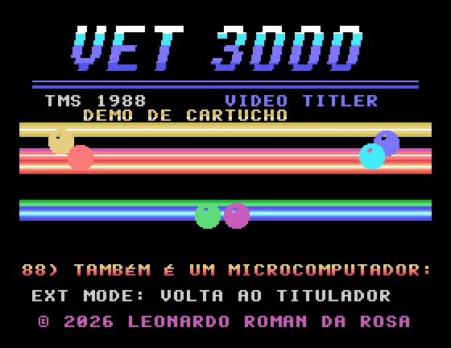
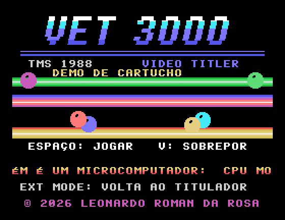
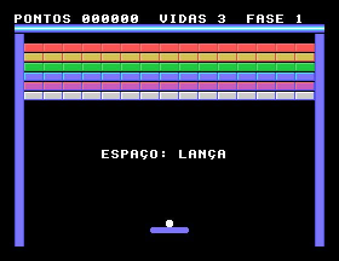

# Cartucho de demonstração: VET 3000 DEMO 1.0

Copyright © 2026 Leonardo Roman da Rosa, sob a GPL-3.0-or-later.

Cartucho de 16 KB para o conector traseiro CN1. Ao ligar o VET 3000 com ele encaixado, o firmware
encontra a assinatura `"OBJECT"` e passa o controle para a demo.

| Abertura | | Jogo |
|---|---|---|
|  |  |  |

## O que ele mostra

**Abertura**

- **Logotipo "VET 3000"** em itálico com degradê por linha de pixel, feito com as cores por segmento
  de 8×1 do modo Graphics II.
- **Barras de cor ("copper bars")** que giram em profundidade. O TMS9128 não tem interrupção de linha;
  o truque é que as 8 linhas de tiles da faixa usam **um único tile cada**, repetido nas 32 colunas.
  Trocar as 8 cores desse tile muda 8 scanlines inteiras. São **64 bytes por quadro** para pintar 64
  linhas, com 5 barras ordenadas por profundidade (primeiro as de trás).
- **Textos em português com acentos**: a fonte 8×8 da demo tem Ç, Ã, Á, É, Ê, Í, Ó e Ú, gravados em
  códigos ASCII que os textos não usam (`#`, `%`, `_`, `&`, `[`, `\`, `^`, `]`). O `gen_assets.py`
  faz a tradução, então os textos são escritos normalmente ("ESPAÇO: LANÇA").
- **Scroller suave** de 2 pixels por quadro. Cada um dos 256 bytes é `(glifo << s) | (próximo >> 8−s)`,
  lido de **fontes pré-deslocadas** guardadas na ROM do cartucho (4 KB de tabelas). O custo é de 15
  ciclos por byte (`LDA n,X` / `ORA n,Y` / `STA`), sem buffer em RAM.
- **Sprites** 16×16 numa curva de Lissajous. A ordem na tabela de atributos gira a cada quadro para
  contornar o limite de 4 sprites por linha, e os sprites piscam em vez de sumir.
- **Sobreposição de vídeo (tecla V):** liga o bit EXTVID e deixa o fundo transparente. Com uma
  câmera ou videocassete na entrada, o letreiro fica sobre o vídeo, que é a função original do
  aparelho. O MAME não emula a entrada de vídeo.

**QUEBRA-TIJOLO**

- Tijolos com relevo em 6 cores (tiles com cor por linha), paredes, placar em BCD, 3 vidas e 4 fases
  que se repetem, cada vez mais rápidas.
- Bola e raquete são sprites. A física usa ponto fixo 8.8, colisão por eixo com os tijolos (mapa de
  bits de 6 × 16 bits em RAM) e ângulo de rebote pela posição na raquete (8 zonas).

## Controles

| Tecla | Ação |
|---|---|
| ESPAÇO | Começa o jogo e lança a bola |
| Z / X, O / P, ←→ (com SHIFT = direita) | Move a raquete |
| RETURN | Pausa |
| V | Sobrepõe ao vídeo externo |
| EXT MODE | Volta ao titulador |
| EXT MODE segurado ao ligar | Pula o cartucho |

## Regras de convivência com o firmware

- Usa só `$0000-$002F`, `$0040-$009F` e `$0190-$01FF`. **Os títulos gravados na RAM ficam intactos**:
  testado no MAME digitando um título, jogando, saindo com EXT MODE e voltando ao texto.
- Sincroniza por `SYNC` com a IRQ mascarada, sem precisar dos vetores em RAM.
- Mantém sempre 8 ciclos ou mais entre acessos à porta de dados do VDP.
- **Calibração:** no início mede os ciclos por quadro e define quantos passos de lógica roda por
  quadro (1 no aparelho a 60 Hz, 3 no MAME 0.289 a 20 Hz). A velocidade fica igual nos dois.

## Orçamento de ciclos (build DEBUG, medido no MAME)

| Cena | Trabalho por quadro | Orçamento a 60 Hz |
|---|---|---|
| Abertura | ~11.000 ciclos | ~14.930 (74% usado) |
| Jogo | ~1.600 ciclos (com 3 passos de lógica) | ~14.930 |

O build DEBUG (`./build.sh debug`) conta, depois de cada quadro, as voltas ociosas de 13 ciclos até
o próximo. O menor valor fica em `$009C`, e as voltas de um quadro inteiro em `$009A`; o script do
MAME imprime os dois com `VET_PEEK=9A,9C`.

## Montagem

```bash
./build.sh              # build/vet3000_demo.bin (16 KB, completado com $FF)
./build.sh debug        # build/vet3000_demo_debug.bin (medição de ciclos)
```

No Windows: `.\build.ps1` ou `.\build.ps1 -Debug`. Use `-Asm C:\caminho\asm6809.exe` (ou a variável
`ASM6809`) se o asm6809 não estiver no PATH.

| Arquivo | Conteúdo |
|---|---|
| `demo.asm` | Programa (6809, sintaxe asm6809) |
| `gen_assets.py` | Fonte 8×8 original (com Ç, Ã, Á, É, Ê, Í, Ó, Ú), textos, logotipo, telas (RLE), fontes pré-deslocadas, seno, tijolos, fases → `assets.inc` |
| `assets.inc` | Gerado; versionado para montar sem Python |
| `pad.py` | Completa a imagem até 16 KB |
| `vet3000_demo.bin` | Imagem pronta para gravar numa 27C128 |

Para gravar e montar o cartucho físico, veja [../../docs/conector-cn1.md](../../docs/conector-cn1.md).
