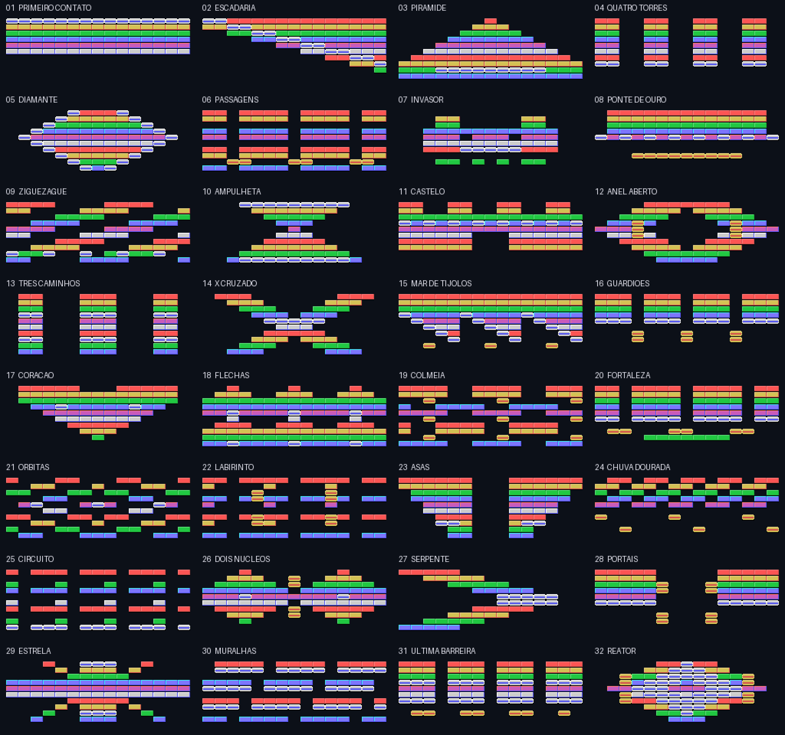
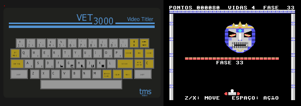

# Cartucho de demonstração: VET 3000 DEMO 1.4

Copyright © 2026 Leonardo Roman da Rosa, sob a GPL-3.0-or-later.

Cartucho de 16 KB para o conector traseiro CN1. Ao ligar o VET 3000 com ele encaixado, o firmware
encontra a assinatura `"OBJECT"` e passa o controle para a demo.

| Abertura | | Jogo |
|---|---|---|
|  |  |  |

## O que ele mostra

**Abertura**

- **Logotipo "VET 3000"** em itálico com degradê por linha de pixel, feito com as cores por segmento
  de 8×1 do modo Graphics II.
- **Ciclo de cores no logotipo:** ele passa por seis temas (azul, roxo, vermelho, dourado, verde e
  água), cada um com o mesmo degradê de 4 níveis de brilho. A troca desce pelo logotipo uma linha
  de pixel a cada 4 quadros, e cada tema completo fica 1 s na tela. Trocar uma linha é gravar um
  byte de cor em cada uma das 23 colunas de tiles, refazendo o endereço da VRAM a cada coluna:
  cerca de 900 ciclos. Os temas, a ordem das linhas e os tempos (`LOGO_THEMES` e `LOGO_ORDER` no
  `gen_assets.py`, `LOGO_STEP` e `LOGO_HOLD` no `demo.asm`) são fáceis de mudar.
- **Barras de cor ("copper bars")** que giram em profundidade. O TMS9128 não tem interrupção de linha;
  o truque é que as 8 linhas de tiles da faixa usam **um único tile cada**, repetido nas 32 colunas.
  Trocar as 8 cores desse tile muda 8 scanlines inteiras. São **64 bytes por quadro** para pintar 64
  linhas, com 5 barras ordenadas por profundidade (primeiro as de trás).
- **Textos em português com acentos**: a fonte 8×8 da demo tem Ç, Ã, Á, É, Ê, Í, Ó e Ú, gravados em
  códigos ASCII que os textos não usam (`#`, `%`, `_`, `&`, `[`, `\`, `^`, `]`). O `gen_assets.py`
  faz a tradução, então os textos são escritos normalmente ("ESPAÇO: LANÇA").
- **Scroller suave** de 2 pixels por quadro. Cada um dos 256 bytes é `(glifo << s) | (próximo >> 8−s)`,
  lido de **fontes pré-deslocadas** guardadas na ROM do cartucho, contendo apenas os glifos usados
  no letreiro para liberar espaço para o jogo. O custo é de 15
  ciclos por byte (`LDA n,X` / `ORA n,Y` / `STA`), sem buffer em RAM.
- **Sprites** 16×16 numa curva de Lissajous. A ordem na tabela de atributos gira a cada quadro para
  contornar o limite de 4 sprites por linha, e os sprites piscam em vez de sumir.
- **Sobreposição de vídeo (tecla V):** liga o bit EXTVID e troca o backdrop (R7) de preto para
  transparente. Com uma câmera ou videocassete na entrada, o letreiro fica sobre o vídeo, que é a
  função original do aparelho. O vídeo externo só aparece onde a cor do pixel é 0 (transparente,
  manual do TMS9918A, p. 51). Por isso todos os fundos da demo usam a cor 0, e não o preto (1): os
  tiles da abertura e do jogo, a faixa das barras, o logotipo e os vãos entre os tijolos. Com o
  backdrop preto a tela fica igual, e com V o vídeo aparece atrás dos textos, das barras, do
  logotipo e dos sprites. O MAME não emula a entrada de vídeo: lá a cor 0 sai preta.

**QUEBRA-TIJOLO**

**Ciclo de demonstração:** a abertura permanece até completar o scroller. Em seguida,
a CPU joga três fases sorteadas, por até 10 segundos cada; o top 10 aparece por 8 segundos,
e a abertura retorna. ESPAÇO inicia uma partida nova em qualquer dessas telas. Pontos da CPU
nunca entram nos recordes. O atalho RETURN para consultar o ranking continua disponível,
mas não aparece como anúncio na abertura.

- Campanha inspirada em **Arkanoid**, com **32 arenas diferentes e um chefão na fase 33**.
  Cada arena tem nome próprio e até 10 fileiras de 15 tijolos: escadaria, pirâmide, invasor,
  castelo, colmeia, labirinto, portais, reator etc. As fases não são apenas espelhamentos.
- Tijolos coloridos de uma batida; **prateados de duas batidas** distribuídos conforme o desenho;
  **dourados indestrutíveis** formando obstáculos e passagens. Só os destrutíveis contam para
  completar a fase. O teste de mapas verifica que nenhum fica selado atrás de ouro.
- Quatro vidas iniciais e dificuldade crescente, até a velocidade vertical de 3 pixels por passo.
- Nome da fase e instruções centralizados, fases indicadas com dois dígitos (01–33),
  moldura metálica segmentada e raquete com corpo claro e terminais vermelhos.
- A cada quatro tijolos destruídos pode cair uma cápsula (uma por vez). Pegue com a raquete:
  **E** aumenta a raquete de 32 para 48 pixels; **S** reduz pela metade o movimento da bola;
  **V** dá uma vida extra, até o limite de 9; **C** prende a bola à raquete no rebote (ESPAÇO relança);
  **B** abre a saída na parede direita (leve a raquete até ela para avançar);
  **L** permite disparar laser com ESPAÇO enquanto a bola está em jogo, um tiro por vez.
  E, S, C e L duram até perder a bola ou mudar de fase. A saída B fica aberta até mudar de fase.
  Laser também quebra prata em duas batidas; ouro bloqueia o tiro.
- **GUARDIÃO**, chefão final original: máscara de 64×64, 24 pontos de energia visíveis,
  movimento lateral, projéteis dirigidos à posição da raquete no momento do disparo e breve
  invulnerabilidade após cada dano. Cada acerto vale 100 pontos. A fase final fornece laser,
  inclusive após perder uma vida. Derrotá-lo encerra a campanha e leva ao ranking.
- Pausa com indicação na tela, pontuação limitada a **999999** e ranking de **10 recordes**
  com três iniciais A–Z. Empates ficam depois dos registros anteriores; zero não entra.
- Bola e raquete são sprites. A física usa ponto fixo 8.8, colisão por eixo com os tijolos (mapa de
  bits de 10 × 16 bits em RAM, mais máscaras de prata/ouro) e ângulo de rebote pela posição na
  raquete (8 zonas).
- O lançamento parado alterna esquerda/direita. Segurar uma direção ao lançar escolhe o lado;
  o rebote durante a partida depende do ponto de contato, com a referência no centro da bola.





## Controles

| Tecla | Ação |
|---|---|
| ESPAÇO | Começa o jogo, lança/solta a bola e dispara com o bônus L |
| Z / X, O / P, ←→ (com SHIFT = direita) | Move a raquete |
| RETURN | Pausa no jogo; abre o top 10 na abertura |
| A–Z, na entrada de iniciais | Digita a letra e avança; na terceira posição, permite substituir a última letra |
| RETURN, na entrada de iniciais | Confirma o nome |
| ESPAÇO, na entrada de iniciais | Avança uma posição; na última, confirma |
| ESPAÇO ou RETURN, no ranking | Volta à abertura |
| V | Sobrepõe ao vídeo externo |
| EXT MODE | Volta ao titulador |
| EXT MODE segurado ao ligar | Pula o cartucho |
| SHIFT+EXT MODE, no editor do titulador | Volta à demo |

## Recordes na SRAM com bateria

O top 10 ocupa **64 bytes em `$0190-$01CF`**, na parte inferior da antiga área de pilha.
A pilha continua começando em `$0200`, com 48 bytes em `$01D0-$01FF`. A abertura usa `$0040`
para barras/sprites alternadamente. No jogo, `$0040-$0067` guarda prata/ouro, `$006B-$0083`
os sprites e `$0084-$0097` os tijolos. `$0080-$0083` volta a receber `EXIT` antes de retornar
ao titulador; não é usado como assinatura durante a partida.
Nenhuma página de texto ou atributo do titulador foi reservada ou reduzida.

Formato: assinatura `B2` (2 bytes), soma de verificação de 16 bits em big-endian (2 bytes),
seguida por dez registros de 6 bytes: pontuação BCD de 3 bytes, mais três letras ASCII.
A assinatura é invalidada antes de cada alteração e gravada por último. Dados sem assinatura
válida ou com soma incorreta são reinicializados. Interromper uma gravação pode zerar o ranking
no próximo boot; não há cópia redundante. Cada letra escolhida é salva imediatamente.

A alimentação **+3 V BAT** já mantém a HY6264 do VET 3000: com a bateria e seu circuito funcionando,
os scores permanecem com o aparelho desligado, assim como os títulos. Se a bateria descarregar
ou for removida, os dados podem se perder.

Testado com o firmware **v2.1** no MAME: entrada de iniciais, retorno ao titulador e à demo,
preservação de todos os bytes de texto/atributos e retenção entre dois processos usando a mesma
NVRAM. O desligamento físico ainda precisa ser confirmado no aparelho. Outros firmwares/cartuchos
podem usar essa área; a demo antiga usava `$0190` para sprites e pode invalidar os recordes.

## Regras de convivência com o firmware

- Usa `$0000-$002F`, `$0035-$003D` (estado de demonstração/teclado), `$0040-$009F`,
  `$0190-$01CF` (ranking) e `$01D0-$01FF` (pilha). Os vetores em `$0039-$003D`
  não são usados como vetores durante a demo, que mantém IRQ/FIRQ mascaradas.
  **Os títulos gravados na RAM ficam intactos**:
  testado no MAME digitando um título, saindo com EXT MODE, voltando à demo com SHIFT+EXT MODE e de
  novo ao titulador.
- **Volta do titulador para a demo:** sempre que devolve o controle ao firmware (saída por EXT MODE
  ou EXT MODE segurado no boot), a entrada troca o comando de SHIFT+EXT MODE (código `$15`, que só
  repetia o EXT MODE) na tabela de comandos em RAM (`$006A`). O comando novo apaga a tela, espera
  EXT MODE ser solta (apertada, ela faria o boot pular o cartucho) e reinicia a máquina. O firmware
  recria a tabela a cada boot, então sem o cartucho o titulador volta a ser o original. Na tela de
  abertura do titulador o EXT MODE é tratado direto pela ROM; o atalho vale no editor.
- Sincroniza lendo o bit F do status do VDP, como o firmware, com IRQ e FIRQ mascaradas. No aparelho,
  o `/INT` do VDP não está ligado ao IRQ do 6809 (medido), então esperar com `SYNC` travaria. As
  imagens anteriores a 29/09/2026 usavam `SYNC`. Funcionavam no MAME 0.289, cujo driver liga o
  `/INT` ao IRQ, mas no VET real ficariam paradas na tela preta, no primeiro quadro.
- Mantém sempre 8 ciclos ou mais entre acessos à porta de dados do VDP.
- **Calibração:** no início mede os ciclos por quadro e define quantos passos de lógica roda por
  quadro (1 no aparelho a 60 Hz, 3 no MAME 0.289 a 20 Hz). A velocidade fica igual nos dois.

## Orçamento de ciclos (referência da versão 1.1)

As medidas abaixo são anteriores aos bônus e ao ranking da versão 1.2.

| Cena | Trabalho por quadro | Orçamento a 60 Hz |
|---|---|---|
| Abertura | ~12.000 ciclos no quadro em que uma linha do logotipo muda | ~14.930 (80% usado) |
| Jogo | ~1.600 ciclos (com 3 passos de lógica) | ~14.930 |

O build DEBUG (`./build.sh debug`) conta, depois de cada quadro, as voltas ociosas de 13 ciclos até
o próximo. O menor valor fica em `$009C`, e as voltas de um quadro inteiro em `$009A`; o script do
MAME imprime os dois com `VET_PEEK=9A,9C`.

## Montagem

```bash
./build.sh              # build/vet3000_demo.bin (16 KB, completado com $FF)
./build.sh debug        # build/vet3000_demo_debug.bin (medição de ciclos)
```

No Windows: `.\build.ps1` ou `.\build.ps1 -Debug`. Use `-Asm C:\caminho\asm6809.exe` (ou a variável
`ASM6809`) se o asm6809 não estiver no PATH.

| Arquivo | Conteúdo |
|---|---|
| `demo.asm` | Programa (6809, sintaxe asm6809) |
| `breakout.inc` | Seis cápsulas, efeitos, ranking e persistência em SRAM |
| `boss.inc` | Chefão final, energia, movimento, projéteis e dano |
| `attract.inc` | Ciclo de demonstração, controle da CPU, sorteio de fases e lançamento |
| `levels.py` | 32 arenas originais (vazio, normal, prata, ouro) |
| `gen_assets.py` | Fonte 8×8 original (com Ç, Ã, Á, É, Ê, Í, Ó, Ú), textos, logotipo, telas (RLE), fontes pré-deslocadas, seno, tijolos, fases → `assets.inc` |
| `assets.inc` | Gerado; versionado para montar sem Python |
| `pad.py` | Completa a imagem até 16 KB |
| `vet3000_demo.bin` | Imagem pronta para gravar numa 27C128 |

Para gravar e montar o cartucho físico, veja [../../docs/conector-cn1.md](../../docs/conector-cn1.md).
