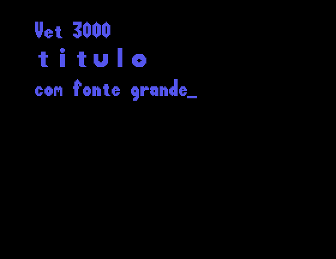

# Firmware v2.1

EPROM 27128 com etiqueta "VET 2.1". Na tela: *"Sistema Operacional Vr 2.1 — TMS MICROSISTEMAS —
Copyright 1988,1989"*.

O firmware segue de perto o do **MFJ-1480B** (*"VET OPERATING SYSTEM (3.0)"*, 1986), versão
comercial do Video Titler da *Radio-Electronics*. Coincidem os registradores do VDP, a ordem das
16 cores, os comandos, os cartuchos de fonte e de programa, a tela de abertura e a fonte normal.
Ver [origem.md](origem.md#7-firmware-e-operação).

| Arquivo | CRC32 | SHA1 |
|---|---|---|
| `rom/VET2.1-TMS_VET3000_27128A.BIN` (16384 bytes) | `bfdef5fa` | `cd4da3cbda7fa12c9413d052bf69ee758cfe68b3` |

É o mesmo dump usado pelo driver `vet3000` do MAME.

O disassembly comentado está em [../disasm/vet3000_v2.1.asm](../disasm/vet3000_v2.1.asm). Os nomes
usados abaixo são os rótulos desse arquivo, e os endereços permitem conferir cada rotina.

| Abertura | Editor (fonte normal e grande) |
|---|---|
|  |  |

## Como o disassembly foi feito

1. **Rastreamento estático** ([tools/dis6809.py](../tools/dis6809.py)): parte dos vetores e segue os
   desvios e as chamadas, incluindo a tabela de comandos auto-relativa (`SYSTAB`, `$E0BA`).
2. **Cobertura dinâmica:** o MAME foi rodado com `trace` enquanto um script Lua digitava todas as
   teclas e combinações. Os 1241 endereços executados ([../disasm/coverage.txt](../disasm/coverage.txt))
   já estavam cobertos pelo rastreamento estático.
3. **Anotações** ([../disasm/hints.py](../disasm/hints.py)): nomes de rotinas e variáveis, blocos de
   dados, textos e comentários.
4. **Verificação:** o `.asm` gerado é remontado com o asm6809 e comparado byte a byte com a EPROM.
   Os modos de endereçamento "não mínimos" usados pelo montador original (por exemplo, deslocamentos
   de 16 bits onde caberiam 8) são forçados com `<<`, `<` e `>`.

## Sequência de boot

| Endereço | Rótulo | O que faz |
|---|---|---|
| `$E000` | `RESET` | `BRA COLD_START` (seguido de `ROM_API`: 3 ponteiros) |
| `$E014` | `COLD_START` | `LDS #$0200`, espera ~64 ms |
| `$E02D` | `VDP_INIT_LOOP` | Programa R0-R7 a partir de `VDP_INIT_TAB` (Graphics II, imagem desligada) |
| `$E04C` | `CLEAR_VRAM` | Zera os 16 KB. Nomes = 0..255 ×3 |
| `$E06F` | `INIT_VARS` | Zera `$05-$2D`, cor inicial, ponteiros de fonte para a ROM |
| `$E09A` | `BUILD_CMDTAB` | Copia `SYSTAB` (deslocamentos auto-relativos) para `cmd_table` (`$40`) |
| `$E0FA` | `INIT_SPRITES` | Termina a lista de sprites (Y = `$D0`) e copia os padrões para `$1800` |
| `$E139` | `PROBE_OBJECT` | Cartucho `"OBJECT"` em `$4000`/`$6000`: `LDX [base+6]` / `JSR base,X` |
| `$E174` | `PROBE_FONT` | Cartucho `"FONT"`: troca os ponteiros de fonte A (em `$4000`) ou B (em `$6000`) |
| `$E1BB` | `CHECK_POWER` | Sem `"POWER"` em `$0030`: grava a assinatura e apaga as 30 páginas |
| `$E1FF` | `START_TITLER` | Desenha a abertura (`TITLE_SCREEN`) e liga a imagem |
| `$E206` | `TITLE_WAIT` | Espera uma tecla. SHIFT+BORDER muda o fundo, EXT MODE sobrepõe |
| `$E221` | `ENTER_EDITOR` | Página 1, cursor ligado |
| `$E231` | `MAIN_LOOP` | Lê a tecla e despacha |

## Laço principal

`GETKEY` devolve um código em `key_code`. Códigos **≥ `$30`** são caracteres e vão para `CMD_CHAR`
(slot 0). Antes, a CAPS (SHIFT+CURSOR) e o SHIFT convertem as letras, e o SHIFT troca os dígitos
pelos símbolos. Com o cursor **desligado**, dígitos compõem um número de página em `page_entry`, e
PAGE vai para aquela página.

Códigos **< `$30`** são comandos: `JSR [cmd_table + 2×código]`. Antes do despacho:

- no modo OBJ, COLOR/←→/↑↓ (`$08-$0A`) somam 3 e viram os comandos do objeto;
- SHIFT soma `$10`, exceto em RETURN, COLOR e CONTROL+CURSOR (`NOSHIFT_KEYS`);
- CONTROL+CURSOR vira `$0F`, e CONTROL+PAGE (com o cursor desligado) vira `$10`;
- com o cursor desligado, alguns comandos são ignorados (`CURSOR_OFF_KEYS`);
- com a imagem desligada, só PAGE, BORDER, EXT MODE, página anterior e fundo funcionam
  (`BLANKED_KEYS`).

## Comandos

| Código | Tecla | Rotina | Função |
|---|---|---|---|
| `$00` | caractere | `CMD_CHAR` `$E41C` | Imprime (fonte normal 8×24 ou grande 16×24) e avança |
| `$01` | PAGE | `CMD_PAGE` `$E5EC` | Próxima página, ou a página digitada (1-30) |
| `$02` | BORDER BLK | `CMD_BORDER` `$E5D7` | Liga/desliga a imagem (só a borda/fundo aparece) |
| `$03` | CLEAR | `CMD_CLEAR_LINE` `$E961` | Apaga a linha |
| `$04` | OBJ | `CMD_OBJ` `$E51E` | Mostra/esconde o objeto 32×32 (4 sprites) |
| `$05` | EXT MODE | `CMD_EXTVID` `$E7A2` | Liga/desliga a sobreposição ao vídeo externo (R0 bit 0) |
| `$06` | CURSOR | `CMD_CURSOR` `$E7D9` | Cursor desligado → bloco (escreve com a fonte A) → sublinhado (fonte B) |
| `$07` | RETURN | `CMD_RETURN` `$E91D` | Próxima linha |
| `$08` | COLOR | `CMD_COLOR` `$E509` | Próxima cor da linha (16 cores, ordem em `COLORMAP`) |
| `$09` | ←→ | `CMD_LEFT` `$E4BB` | Cursor à esquerda |
| `$0A` | ↑↓ | `CMD_DOWN` `$E4F8` | Cursor para baixo |
| `$0B` | OBJ: COLOR | `CMD_OBJ_COLOR` `$E99C` | Cor do objeto |
| `$0C` | OBJ: ←→ | `CMD_OBJ_LEFT` `$E981` | Objeto para a esquerda (4 px) |
| `$0D` | OBJ: ↑↓ | `CMD_OBJ_DOWN` `$E98D` | Objeto para baixo |
| `$0E` | AUTO CENTER | `CMD_CENTER` `$E9DF` | Centraliza a linha |
| `$0F` | CONTROL+CURSOR | `CMD_FONTSIZE` `$E7BE` | Alterna fonte grande/normal na linha |
| `$10` | CONTROL+PAGE | `CMD_ROLL` `$EB34` | **Rolagem vertical suave** das páginas (créditos). ESPAÇO para |
| `$11` | SHIFT+PAGE | `CMD_PAGE_PREV` `$E797` | Página anterior |
| `$12` | SHIFT+BORDER BLK | `CMD_BACKDROP` `$E784` | Próxima cor de fundo (R7) |
| `$13` | SHIFT+CLEAR | `CMD_CLEAR_PAGE` `$E932` | Apaga a página |
| `$14` | SHIFT+OBJ | `CMD_OBJ_SHAPE` `$E77A` | Próxima forma do objeto (4 formas) |
| `$15` | SHIFT+EXT MODE | `CMD_EXTVID` | Igual a EXT MODE (a demo usa esta entrada para voltar ao cartucho) |
| `$16` | SHIFT+CURSOR | `CMD_CAPS` `$E7B7` | Trava de maiúsculas |
| `$19` | SHIFT+←→ | `CMD_RIGHT` `$E70E` | Cursor à direita |
| `$1A` | SHIFT+↑↓ | `CMD_UP` `$E74E` | Cursor para cima |
| `$1B` | OBJ: SHIFT+COLOR | `CMD_OBJ_COLOR` | Cor do objeto |
| `$1C` | OBJ: SHIFT+←→ | `CMD_OBJ_RIGHT` `$E9A6` | Objeto para a direita |
| `$1D` | OBJ: SHIFT+↑↓ | `CMD_OBJ_UP` `$E9B5` | Objeto para cima |
| `$1E` | SHIFT+AUTO CENTER | `CMD_CENTER_ALL` `$E9C1` | Centraliza todas as linhas |
| `$17`, `$18`, `$1F` | — | 0 | Sem função |

Como a tabela fica em RAM (`$0040-$007F`), **um cartucho pode trocar ou acrescentar comandos** e
voltar para o titulador (`RTS`), que passa a usá-los. O cartucho de demonstração faz isso com
SHIFT+EXT MODE (ver [programando-cartuchos.md](programando-cartuchos.md#voltar-do-titulador-para-o-cartucho)).

## Tela e páginas

- Modo **Graphics II** usado como bitmap: 8 linhas de texto de 24 pixels × 32 colunas de 8 pixels.
- Cada linha tem **uma cor**, com fundo transparente para funcionar sobre o vídeo externo, e pode usar
  a **fonte normal** (32 caracteres de 8×24) ou a **grande** (16 caracteres de 16×24).
- **30 páginas** de 8 × 32 caracteres em `$0200-$1FFF`, mais 1 byte de atributos por linha em
  `$00A0-$018F`. Tudo mantido pela bateria.
- **Objeto:** 4 sprites 16×16 formam uma figura de 32×32, movida pelas setas. São 4 formas: seta,
  moldura retangular, moldura oval e X, as mesmas do titulador da revista e do MFJ-1480B.
- **Rolagem** (CONTROL+PAGE): as linhas sobem pixel a pixel, página após página. A rotina reescreve
  os padrões com o deslocamento `tmp07` (0-7) dentro de cada tile.

## Conjunto de caracteres interno

| Código | Caracteres |
|---|---|
| `$13-$1E` | á â ã à é ê í ó ô õ ú ç |
| `$1F-$2A` | Á Â Ã À É Ê Í Ó Ô Õ Ú Ç |
| `$2B-$2F` | blocos gráficos (meios e cheio) |
| `$30-$39` | 0-9 |
| `$3A-$3F` | `:` `,` `!` `?` `.` `$` |
| `$40` | espaço |
| `$41-$5A` | A-Z |
| `$5B-$60` | `%` `-` `'` `(` `)` `/` |
| `$61-$7A` | a-z |
| `$7B-$7E` | logotipo "tms" (só na fonte normal) |
| bit 7 | fonte B: gravado quando o cursor está sublinhado (cartucho FONT em `$6000`) |

Os textos da própria ROM usam esse conjunto: `"Sistema@Operacional@Vr@2>1"`.

## Fontes

| Fonte | Endereço | Formato | Ponteiros |
|---|---|---|---|
| Grande 16×24 | `$C000` | 48 bytes/glifo: para cada linha de tile, tile esquerdo (8 bytes) e direito (8 bytes) | `fonta_big` (`$35`), `fontb_big` (`$37`) |
| Normal 8×24 | `$D380` | 24 bytes/glifo: 3 tiles | `fonta_small` (`$29`), `fontb_small` (`$2B`) |
| 8×8 | `$DDA0` | 8 bytes/glifo, a partir de `$30` | Usada só na abertura |

O glifo do código *c* fica em `base + (c − $13) × tamanho`. Imagens em
[mapa-de-memoria.md](mapa-de-memoria.md#rom-16-kb).

## Observações

- **Interrupções:** o firmware nunca habilita IRQ e sincroniza com o VDP lendo o status
  (`VDP_WAIT_VBLANK`, `$EA9F`).
- **Pausa entre escritas:** `VDP_DELAY` (`$EADB`) é só um `RTS`, chamado entre escritas na VRAM
  para respeitar o tempo de acesso do TMS9128.
- **Código relocável:** o código usa endereçamento relativo ao PC (`LEAX tabela,PCR`) em quase todo
  lugar, e a `SYSTAB` é auto-relativa.
- **Espaço livre:** sobram 238 + 3052 bytes em `$FF`, o suficiente para correções ou novos
  comandos numa EPROM modificada.
- **"C" amarelo:** a tecla não é lida. No MFJ-1480B, as teclas B, C e CNTL eram reservadas para
  cartuchos futuros (ver [teclado.md](teclado.md)).
- **Vetores em RAM** e a **tabela `ROM_API`** em `$E002` indicam que a TMS previa programas externos.
