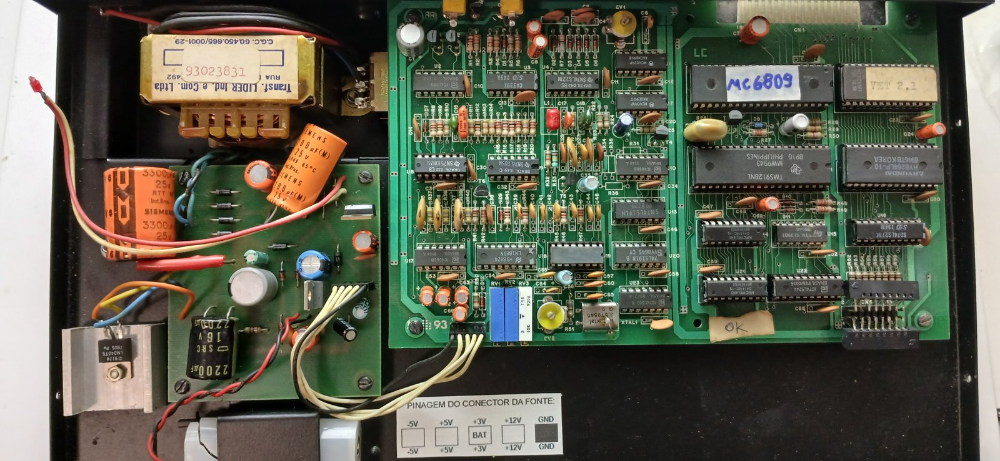
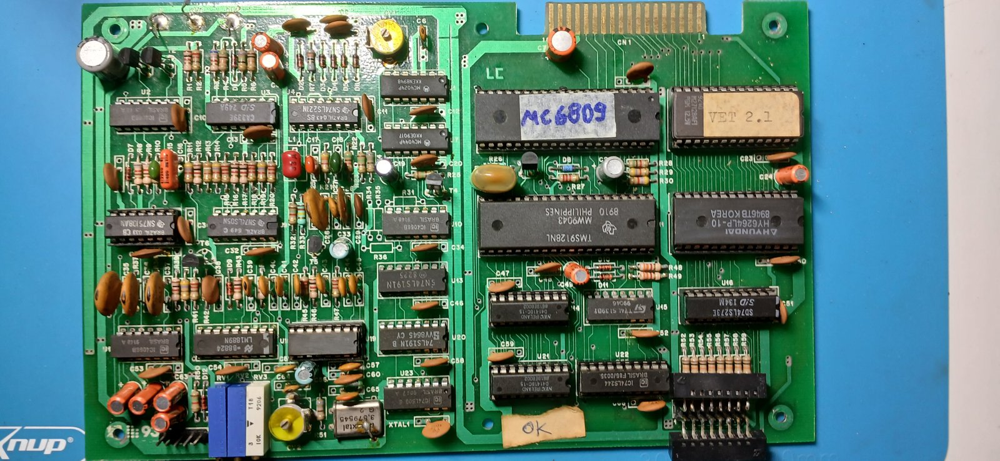
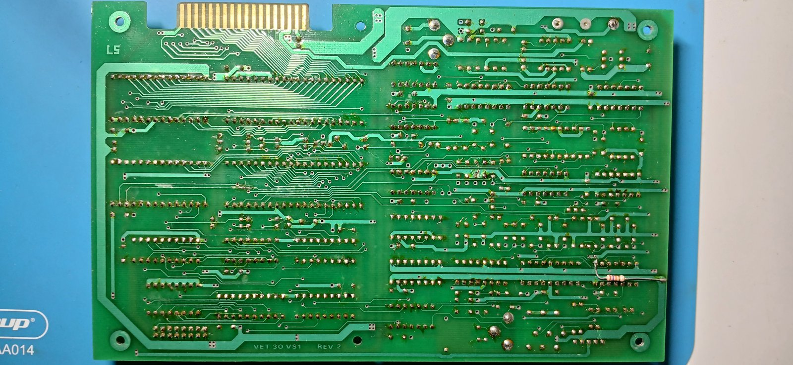

# Hardware do VET 3000

O aparelho tem duas placas: a **fonte de alimentação** (à esquerda na foto) e a **placa principal**
(serigrafia `VET 30 VS1 REV. 2` no lado da solda). A placa principal se divide em duas metades:

- **digital** (direita): CPU, ROM, RAM, VDP, VRAM, decodificação, teclado e o conector traseiro CN1;
- **analógica** (esquerda): entrada e saída de vídeo, *genlock*/sincronismo, chaveamento do vídeo
  externo e codificação de cor.

O circuito é o do **"Build This Video Titler"** da revista *Radio-Electronics* (1985-1986), vendido
nos EUA como **MFJ-1480B**, com outra PCB. O esquema publicado explica a parte analógica, que não
foi medida no VET. A comparação completa está em [origem.md](origem.md).

Fotos em alta resolução em [../photos/](../photos/). O esquema aproximado da placa (parte digital) está
em [../hardware/placa-principal/](../hardware/placa-principal/README.md), com um roteiro de continuidade.

| Componentes | Lado da solda |
|---|---|
|  |  |

## Componentes identificados

### Parte digital

| Ref. | Componente | Função |
|---|---|---|
| — | **MC6809** (etiqueta escrita à mão) | CPU. Na revista, o clock de entrada vem do CPUCLK do VDP (3,579545 MHz): E = 894,886 kHz |
| — | **M27128AF1** (ST), etiqueta "VET 2.1", código 9240 | EPROM de 16 KB com o firmware, em `$C000-$FFFF` |
| — | **HY6264LP-10** (Hyundai, 8946) | RAM estática 8K×8 (**64 Kbit = 8 KB**), com bateria, em `$0000-$1FFF` |
| — | **TMS9128NL** (TI, 8910, Filipinas) | VDP. Saídas Y, R-Y e B-Y, com modos e sprites iguais aos do TMS9918A |
| U14, U21 | **µPD41416C-15** (NEC Irlanda) | 2 DRAMs 16K×4 = **16 KB de VRAM** |
| U15 | **74LS139** (ST) | Decodificador de endereços (duplo 2→4) |
| U16 | **74LS273** | Latch de escrita da linha do teclado (`$8002`) |
| U22 | **74LS244** + R52-R59 | Buffer de leitura das colunas do teclado (`$8002`), com *pull-ups* |
| — | Conector 2×8 | Membrana do teclado: 8 trilhas em cada camada |
| D10, D11 + R48, R49 (3k3) | 1N914 | OU com diodos da seleção da ROM (ROM SEL) e da E/S (I/O SEL), como D5/D6 e R41/R42 da revista |
| R28 (5k1), R29, R30 (4k7) | Resistores | *Pull-up* do /RESET e de /HALT e /IRQ |
| D8, R26, R27 (2k2) | Zener e resistores | Nível de 3 estados do RESET/SYNC do VDP (revista: D2, R17, R18) |
| CN1 | Borda de placa 2×18 | Conector traseiro "interface": barramento da CPU. Ver [conector-cn1.md](conector-cn1.md) |

### Parte analógica e de vídeo

As funções vêm do esquema da revista (Figs. 7, 8, 11 e 13). Os números de CI entre parênteses são os
da revista.

| Ref. | Componente | Função provável |
|---|---|---|
| XTAL1 | Cristal **3,579545 MHz** + trimmer **CV2** | Cristal do oscilador de croma do U19 (ligado ao pino 6 por R51, de 680 Ω). Subportadora **NTSC** (315/88 MHz) e referência do PLL no modo interno. CV2 = C27 da revista (cores e faixa de captura da croma) |
| U19 | **CA3126** (RCA) com a **marcação raspada**, 16 pinos | Processador de croma (IC14): regenera os 3,58 MHz travados no *burst* do vídeo externo e fornece o *CHROMA CLOCK* ao PLL. Confirmado pelas ligações dos pinos 5, 6, 9 e 12 (ver [origem.md](origem.md#8-o-ci-raspado-u19-é-um-ca3126)) |
| — | **LM1889N** (National) (IC16) | Modulador de croma: monta o vídeo composto do VDP a partir de Y, R-Y e B-Y |
| U7, U1, T4 | **MC4044P** + **MC4024P** (Motorola) (IC4, IC5) + transistor T4 + trimmer **CV1** | PLL que gera o clock mestre do VDP: 3 × 3,579545 MHz no modo interno, 684 × a frequência horizontal externa no *genlock*. CV1 = C12 da revista (frequência do VCO) |
| U13, U20 | **74LS191** ×2 (IC6, IC7) | Dividem o CPUCLK do VDP por 228 (= mestre ÷ 684): pulso horizontal comparado no *genlock* |
| U4 | **74LS221** (IC2) | Monoestáveis: pulso horizontal externo (~50 µs, ignora os pulsos de equalização) e *burst gate* (~3 µs) |
| U3 | **CA339E** (IC1) | Comparadores: sincronismo composto e vertical do vídeo externo e sinais de seleção de modo interno/externo |
| U8 | **SN75108AN** (IC17) | Comparador rápido no sinal B-Y: escolhe, ponto a ponto, entre a imagem do VDP e o vídeo externo |
| U2, U10, U17 | **4066** ×3 (IC8, IC9, IC13) | Chaves analógicas: entradas do PLL por modo, polarização da croma e mistura dos dois vídeos |
| U9 | **74LS05** (IC3) | Inversores com coletor aberto (reset vertical híbrido do VDP, modos) |
| U23 | **74LS00** (IC15) | Decodificação (E com /HALT) e lógica de modo |
| RV1-RV3 | Trimpots | Equivalem a R29, R32 e R46 da revista (correspondência não verificada): cor no modo externo, nível do vídeo do VDP e limiar de chaveamento do vídeo externo |

### Fonte

Transformador LIDER, regulador **7805** (LM340T-5), filtros de 3300 µF e 2200 µF. O conector da fonte,
conforme a etiqueta no gabinete, tem **−5 V, +5 V, +3 V BAT, +12 V e GND**. A linha **+3 V BAT** alimenta
a RAM (pino 28 da HY6264) e mantém os títulos com o aparelho desligado.

## Clocks

| Sinal | Valor | Observação |
|---|---|---|
| Entrada do TMS9128 (pino 40) | **10,738635 MHz** = 3 × 3,579545 | Gerada pelo PLL (MC4044 + VCO MC4024). No modo interno, o PLL trava o CPUCLK no *CHROMA CLOCK* do oscilador de croma. No *genlock*, trava o CPUCLK ÷ 228 no sincronismo horizontal do vídeo de entrada, e o clock sobe para ≈ 10,762 MHz |
| CPUCLK do TMS9128 (pino 37) | 3,579545 MHz | Clock mestre ÷ 3. Na revista, alimenta o `EXTAL` do 6809 e os divisores 74LS191 |
| Pixel | 5,369 MHz | 342 pixels por linha, 262 linhas |
| CPU (E) | 894,886 kHz | CPUCLK ÷ 4 (o MC6809 divide o clock de entrada por 4), como no MAME e no TRS Color. **Confirmar** com frequencímetro no pino 34 (E) |
| Quadro | cerca de **14.930 ciclos de CPU** | Orçamento de processamento por quadro a 60 Hz |

Não há cristal perto do 6809 nem do TMS9128: o VDP recebe o clock do PLL, e o 6809 recebe o do VDP.
O clock da CPU acompanha o PLL, inclusive no *genlock*. O driver do MAME 0.289 declara o VDP a
3,58 MHz, o que dá 19,97 Hz de quadro (ver [mame.md](mame.md)).

## Caminho do vídeo

O TMS9128 gera luminância e diferenças de cor (Y, R-Y, B-Y) e o LM1889 as codifica em vídeo composto.
A imagem do VDP é sobreposta ao vídeo da entrada traseira quando o bit **EXTVID** (registrador 0, bit 0)
está ligado. Nesse modo a cor 0 (transparente) e o fundo transparente deixam ver o vídeo externo.
A tecla **EXT MODE** do firmware liga e desliga esse bit.

Segundo a revista, no modo externo:

- o CA339 e o 74LS221 extraem do vídeo de entrada o sincronismo horizontal, o vertical e a janela do
  *burst*;
- o PLL faz o clock do VDP acompanhar a linha do vídeo externo, e o vertical externo (com pulsos
  horizontais inseridos) reinicia os contadores do VDP pelo pino RESET/SYNC, elevado a 12 V por um
  transistor;
- o CA3126 trava a subportadora do LM1889 no *burst* externo, para as cores do VDP não variarem;
- nos pontos transparentes, o B-Y do VDP vai a um nível especial. O SN75108 detecta esse nível e as
  chaves 4066 passam o vídeo externo em vez da imagem do VDP.

O cristal XTAL1 de **3,579545 MHz é a subportadora de cor do NTSC**, então o VET 3000 gera vídeo
**NTSC** (o PAL-M brasileiro usaria 3,575611 MHz). Tudo deriva desse valor: o VDP roda a 3 × 3,579545
= 10,738635 MHz, e o 6809 a 3,579545 ÷ 4 = 0,895 MHz, a mesma relação usada no MSX e no TRS Color.

## Temporização de acesso à VRAM

Conforme o *TMS9918A Data Manual* (tabela 2-2), na área ativa dos modos Graphics I/II o VDP pode
levar **até 8 µs** para aceitar um novo acesso à VRAM. Durante o apagamento vertical (~4,3 ms após a
interrupção), ou com a imagem desligada, bastam **2 µs**.

Com o 6809 a 0,895 MHz, 8 µs são **7,2 ciclos**. Regra prática: manter **pelo menos 8 ciclos** entre
dois acessos à porta de dados (`$8000`). Um `STA $8000` leva 5 ciclos, então dois seguidos (5,6 µs)
podem falhar no meio da imagem, mas `LDA ,X+` / `STA $8000` (11 ciclos) é sempre seguro. O próprio
firmware chama uma sub-rotina vazia (`VDP_DELAY`, só `RTS`) entre escritas para garantir esse
intervalo.

## Pontos a confirmar no aparelho real

- clock real do 6809 (pino 34, E) e do TMS9128 (pino 40, entrada; pino 37, CPUCLK), e se o pino 37
  do VDP vai ao `EXTAL` (pino 38) do 6809, como na revista;
- sinais do 74LS139 que chegam ao CN1 (pinos 10, 11, 14 e 16 de cima). As ligações estão medidas e
  batem com a porta de expansão da revista; falta ver os sinais funcionando (ver
  [conector-cn1.md](conector-cn1.md)).

Já medido: U19 é um CA3126, e o `/INT` do VDP (pino 16) **não** está ligado ao `/IRQ` do 6809
(pino 3). A CPU não recebe a interrupção de quadro, e os programas precisam ler o status do VDP
(ver [programando-cartuchos.md](programando-cartuchos.md#4-sincronismo-com-o-quadro-sem-vetores)).
