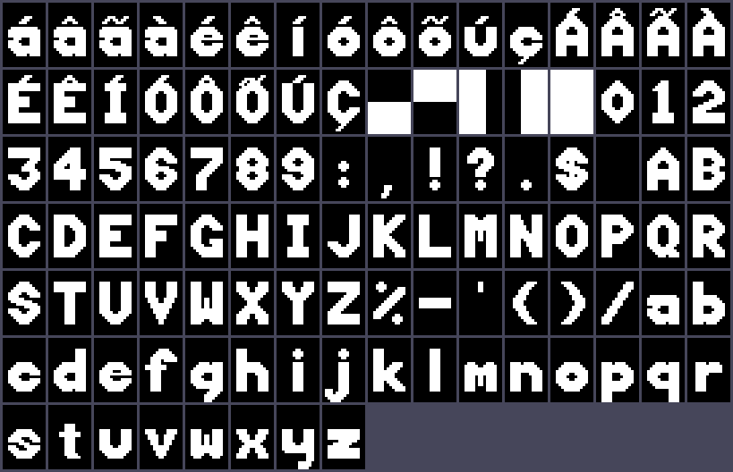
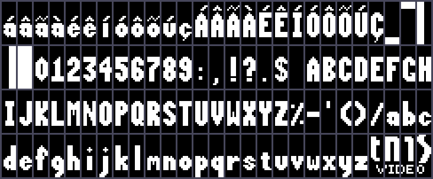
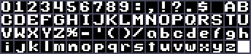

# Mapa de memória

## Espaço da CPU (MC6809)

| Faixa | Tamanho | Dispositivo | Observação |
|---|---|---|---|
| `$0000-$1FFF` | 8 KB | RAM HY6264 (com bateria) | Página direta em `$00xx` (DP = 0). Provavelmente espelhada em `$2000-$3FFF` |
| `$4000-$7FFF` | 16 KB | **Cartucho** (conector CN1) | A ROM procura `"OBJECT"`/`"FONT"` em `$4000` e `$6000` |
| `$8000` | 1 | TMS9128, porta de **dados** (MODE = 0) | Leitura e escrita da VRAM |
| `$8001` | 1 | TMS9128, porta de **controle** (MODE = 1) | Escrita: endereço/registrador. Leitura: status |
| `$8002` | 1 | **Teclado** | Escrita: seleciona a linha (74LS273). Leitura: colunas (74LS244) |
| `$8003-$BFFF` | — | Faixa de E/S | Não usada pela ROM. O decodificador pode espelhar `$8000-$8002` |
| `$C000-$FFFF` | 16 KB | EPROM 27128 (firmware) | Vetores em `$FFF0-$FFFF` |

O mapa acima é o do driver do MAME, confirmado pelos acessos que a ROM faz. A decodificação
provável usa o 74LS139 (U15) em blocos de 16 KB (A15/A14): `Y0` RAM, `Y1` cartucho, `Y2` E/S, `Y3` ROM.
Isso bate com o que chega ao CN1: `Y1` (pino 14), `Y2` (pino 11) e o *Chip Enable* da EPROM (pino 10). Ver [conector-cn1.md](conector-cn1.md).

## Vetores

| Vetor | Endereço | Destino | Efeito |
|---|---|---|---|
| RESET | `$FFFE` | `$E000` | `BRA COLD_START` |
| NMI, FIRQ, IRQ | `$FFFC`, `$FFF6`, `$FFF8` | `$E008` | `JMP [$0039]` |
| SWI | `$FFFA` | `$E00C` | `JMP [$003B]` |
| SWI2, SWI3 | `$FFF4`, `$FFF2` | `$E010` | `JMP [$003D]` |

A ROM **nunca habilita interrupções** (não executa `ANDCC`) nem grava esses ponteiros: eles são
ganchos para programas de cartucho. A linha IRQ recebe o `/INT` do VDP e o pino 1 da fileira superior
do CN1.

Em `$E002` há uma pequena tabela de ponteiros para uso de cartuchos: `$E322` (GETKEY, espera uma
tecla), `$E375` (KBD_SCAN, varre o teclado) e `$E231` (MAIN_LOOP, laço de comandos do titulador).

## Registradores do VDP (como o firmware os programa)

| Reg. | Valor | Significado |
|---|---|---|
| R0 | `$02` | M3 = Graphics II. O bit 0 (EXTVID) é alternado pela tecla EXT MODE |
| R1 | `$82` / `$C2` | VRAM de 16K e sprites 16×16. O bit 6 (imagem) é alternado por BORDER BLK. **IE = 0** sempre |
| R2 | `$0E` | Tabela de nomes em `$3800` |
| R3 | `$FF` | Tabela de cores em `$2000` (máscara completa, bitmap) |
| R4 | `$03` | Tabela de padrões em `$0000` (3 bancos de 2 KB) |
| R5 | `$78` | Atributos de sprites em `$3C00` |
| R6 | `$03` | Padrões de sprites em `$1800` |
| R7 | `$00` | Cor de fundo/borda. SHIFT+BORDER BLK percorre as 16 cores |

## VRAM (16 KB) no titulador

| Faixa | Conteúdo |
|---|---|
| `$0000-$17FF` | Padrões, 3 bancos (a tela é tratada como bitmap: nome = posição) |
| `$1800-$19FF` | Padrões dos 16 sprites do modo OBJ (copiados de `$F0A3` na ROM) |
| `$2000-$37FF` | Cores (uma cor por linha de texto, com fundo transparente) |
| `$3800-$3AFF` | Nomes: `0..255` repetido nos três terços |
| `$3C00-$3C7F` | Atributos de sprites (4 sprites formam o objeto 32×32) |

Cada **linha de texto** ocupa 3 linhas de tiles (24 pixels), e a tela tem 8 linhas de texto. A linha L,
coluna C (de 8 pixels) começa no endereço de padrões `L×$300 + C×8`. Cada linha de tile fica `$100`
adiante.

## RAM (8 KB)

### Variáveis do firmware (página direta)

| End. | Nome no disassembly | Uso |
|---|---|---|
| `$00` | `vdp_r0` | Cópia do R0 (bit 0 = EXTVID) |
| `$01` | `vdp_r1` | Cópia do R1 (bit 6 = imagem ligada) |
| `$02` | `backdrop` | Índice (0-15) da cor de fundo |
| `$03-$04` | `key_delay` | Atraso de *debounce* (`$0100`) |
| `$05-$06` | `kbd_scan`, `kbd_rows` | Varredura do teclado |
| `$07-$08` | `tmp07`, `tmp08` | Temporários e rolagem |
| `$09-$0A` | `cell_vaddr` | Endereço VRAM da célula do cursor |
| `$0B` | `cur_line` | Linha de texto (0-7) |
| `$0C` | `cur_col` | Coluna (0-31) |
| `$0E` | `tmp0e` | Temporário e caractere |
| `$0F` | `cursor_mode` | 0 desligado, 1 bloco (fonte A), 2 sublinhado (fonte B) |
| `$10` | `key_shift` | SHIFT apertado |
| `$11` | `extvid_on` | Bit 7 = sobreposição ativa |
| `$12` | `display_on` | Bit 6 = imagem ligada |
| `$13` | `obj_mode` | Objeto (sprites) visível |
| `$14` | `page` | Página atual (0-29) |
| `$15-$16` | `tmp15` | Deslocamento temporário |
| `$17-$1A` | `obj_color`, `obj_y`, `obj_x`, `obj_shape` | Objeto de 4 sprites |
| `$1C` | `color_idx` | Índice da cor da linha (tecla COLOR) |
| `$1D` | `caps_lock` | Bit 7 = maiúsculas (SHIFT+CURSOR) |
| `$1E` | `key_code` | Tecla traduzida |
| `$1F` | `key_raw` | Tecla crua (tabela KEYMAP) |
| `$20` | `key_last` | Auto-repetição |
| `$21-$23` | `cursor_pat` | Desenho do cursor |
| `$24` | `line_color` | Cor da linha no formato do VDP (frente<<4, fundo 0 = transparente) |
| `$25` | `key_ctrl` | CONTROL apertado |
| `$26` | `key_mod3` | Linha 7, bit 3: lido e **nunca usado** |
| `$27` | `page_entry` | Número de página digitado (BCD) |
| `$28` | `big_font` | Linha atual em fonte grande |
| `$29-$2C` | `fonta_small`, `fontb_small` | Ponteiros das fontes normais (8×24) |
| `$2D-$2E` | `key_repeat` | Contador de auto-repetição |
| `$2F` | `tmp2f` | Temporário |
| `$30-$34` | `power_sig` | Assinatura **"POWER"**: a RAM tem dados válidos |
| `$35-$38` | `fonta_big`, `fontb_big` | Ponteiros das fontes grandes (16×24) |
| `$39-$3E` | `irq_vector`, `swi_vector`, `swi23_vector` | Vetores em RAM (só cartuchos) |
| `$3F` | `roll_stop` | ESPAÇO interrompeu a rolagem |
| `$40-$7F` | `cmd_table` | 32 ponteiros de comandos (copiados de SYSTAB no boot) |

### Áreas

| Faixa | Conteúdo | Persistente? |
|---|---|---|
| `$0000-$007F` | Variáveis acima | Não: recriadas no boot, exceto "POWER" |
| `$0080-$009F` | **Não usada** pelo firmware | — |
| `$00A0-$018F` | Atributos: 30 páginas × 8 linhas (bit 0 = fonte grande, bits 4-7 = cor) | **Sim** |
| `$0190-$01FF` | Pilha (S começa em `$0200`) | Não |
| `$0200-$1FFF` | Texto: 30 páginas × 8 linhas × 32 caracteres | **Sim** |

No boot, se `"POWER"` não está em `$0030`, o firmware grava a assinatura e preenche textos e
atributos com `$40` (espaço). Por isso **um cartucho pode usar `$0000-$002F`, `$0035-$009F` e
`$0190-$01FF` sem apagar os títulos**.

## ROM (16 KB)

| Faixa | Conteúdo |
|---|---|
| `$C000-$D37F` | Fonte grande 16×24: 104 glifos (`$13-$7A`), 48 bytes cada |
| `$D380-$DD3F` | Fonte normal 8×24: 104 glifos, 24 bytes cada |
| `$DD40-$DD9F` | Glifos `$7B-$7E` da fonte normal (logotipo "tms", digitável com CONTROL) |
| `$DDA0-$DFFF` | Fonte 8×8 da tela de abertura (`$30-$7B`) |
| `$E000-$F012` | Código e tabelas |
| `$F013-$F0A2` | Logotipo "tms" (3 × 6 tiles) |
| `$F0A3-$F2A2` | 16 padrões de sprite 16×16 (objetos) |
| `$F2A3-$F390` | **Livre** (`$FF`, 238 bytes) |
| `$F391-$F403` | Código (acentos com CONTROL, índice da fonte grande) |
| `$F404-$FFEF` | **Livre** (`$FF`, 3052 bytes) |
| `$FFF0-$FFFF` | Vetores |

  
