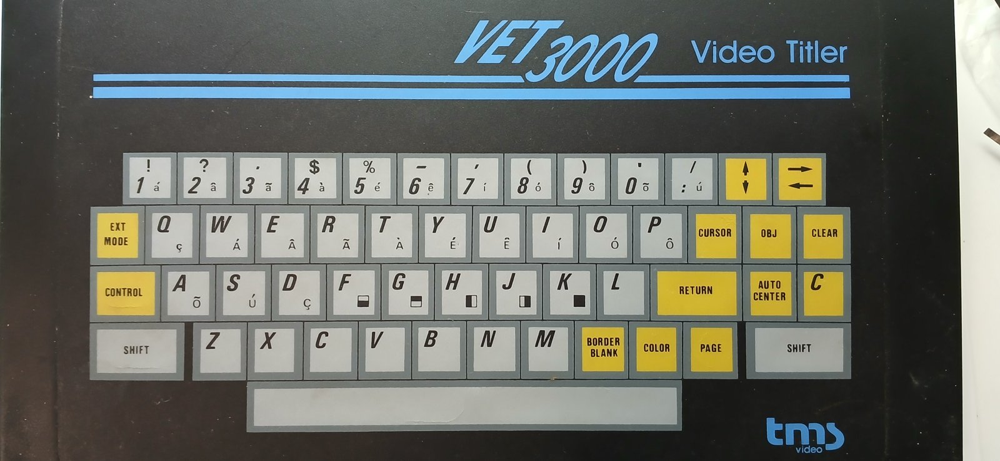

# Teclado



O teclado é de membrana com duas camadas de 8 trilhas cada, ligadas à placa por um conector 2×8.

- A camada **inferior** recebe a seleção de **linha** do latch **74LS273** (U16), escrito em `$8002`.
  A trilha 8 não tem conexão física: são 7 linhas.
- A camada **superior** devolve as **colunas** pelo buffer **74LS244** (U22), lido em `$8002`, com
  *pull-ups* R52-R59.

Tudo é **ativo em 0**. Para ler a linha *n* (1-7), escreva em `$8002` um byte com o bit *n−1* em 0 e
os demais em 1. Depois leia `$8002`: um bit em 0 indica tecla apertada naquela coluna.

As medidas originais estão em
[medidas-originais/mapeamento do teclado vet3000.txt](medidas-originais/mapeamento%20do%20teclado%20vet3000.txt).
Elas batem com o driver do MAME: trilha inferior *n* = bit *n−1* escrito, trilha superior *m* = bit *m−1* lido.

## Matriz

| Linha (escrita) | bit 0 | bit 1 | bit 2 | bit 3 | bit 4 | bit 5 | bit 6 | bit 7 |
|---|---|---|---|---|---|---|---|---|
| 1 (`$FE`) | 1 | Q | A | **SHIFT** | 7 | U | J | N |
| 2 (`$FD`) | 2 | W | S | **CONTROL** | 8 | I | K | M |
| 3 (`$FB`) | 3 | E | D | EXT MODE | 9 | O | L | ESPAÇO |
| 4 (`$F7`) | 4 | R | F | — | 0 | P | RETURN | BORDER BLK |
| 5 (`$EF`) | 5 | T | G | — | : | CURSOR | AUTO CENTER | COLOR |
| 6 (`$DF`) | 6 | Y | H | **C amarelo** | ↑↓ | OBJ | — | PAGE |
| 7 (`$BF`) | Z | X | C | — | ←→ | CLEAR | V | B |

Os dois SHIFTs estão no mesmo ponto. As teclas amarelas ↑↓ e ←→ são uma tecla só cada: sem SHIFT
movem para baixo/esquerda, com SHIFT para cima/direita.

## Como o firmware lê (KBD_SCAN, `$E375`)

1. Varre as 7 linhas (`$7E`, `$7D`, `$7B`, …), ignorando a coluna do bit 3 (modificadores), exceto
   na linha 3 (EXT MODE). A primeira tecla encontrada é traduzida pela tabela **KEYMAP** (`$E3E4`,
   56 bytes).
2. Lê os modificadores em separado: **SHIFT** (linha 1, bit 3) em `$10` e **CONTROL** (linha 2, bit 3)
   em `$25`. A linha 7, bit 3 vai para `$26`, mas nada no firmware usa esse valor.
3. **GETKEY** (`$E322`) faz o *debounce* (`$03-$04`) e a auto-repetição (`$2D-$2E`) para códigos
   ≥ `$09`, ou seja, caracteres, setas e AUTO CENTER. PAGE, BORDER BLK, CLEAR, OBJ, EXT MODE,
   CURSOR, RETURN e COLOR não repetem.

Consequência: o **"C" amarelo** (linha 6, bit 3) está na coluna ignorada e fora das linhas de
modificador. **No firmware v2.1 ele não faz nada.** Talvez fosse para ser um terceiro modificador,
lido por engano na linha 7.

## Códigos de tecla (KEYMAP)

Letras e dígitos geram o próprio código ASCII (`a`-`z` minúsculas, `0`-`9`, `:`). O espaço gera `$40`.
As teclas de função geram:

| Código | Tecla | Código | Tecla |
|---|---|---|---|
| `$01` | PAGE | `$07` | RETURN |
| `$02` | BORDER BLK | `$08` | COLOR |
| `$03` | CLEAR | `$09` | ←→ |
| `$04` | OBJ | `$0A` | ↑↓ |
| `$05` | EXT MODE | `$0E` | AUTO CENTER |
| `$06` | CURSOR | `$1F` | posição sem tecla (linha 6, bit 6) |

Com SHIFT: letras viram maiúsculas, e os dígitos dão os símbolos da tecla (`1`→`!`, `2`→`?`, `3`→`.`,
`4`→`$`, `5`→`%`, `6`→`-`, `7`→`'`, `8`→`(`, `9`→`)`, `0`→`,`, `:`→`/`). Com CONTROL, dígitos e
letras dão os acentuados e os blocos gráficos impressos no canto das teclas (tabela `ACCENT_TAB`
em `$F3BE`). As teclas de função com SHIFT ou CONTROL viram outros comandos: ver
[firmware.md](firmware.md#comandos).

## Lendo o teclado num programa

```asm
KEYBOARD equ $8002
        lda  #$FB          ; linha 3
        sta  KEYBOARD
        lda  KEYBOARD
        bita #$80          ; bit 7 = ESPAÇO (0 = apertada)
        beq  espaco_apertado
```

A demo tem uma rotina completa (`read_keys` em
[cartridge/demo/demo.asm](../cartridge/demo/demo.asm)) que junta várias teclas num byte e
detecta as bordas de subida.
