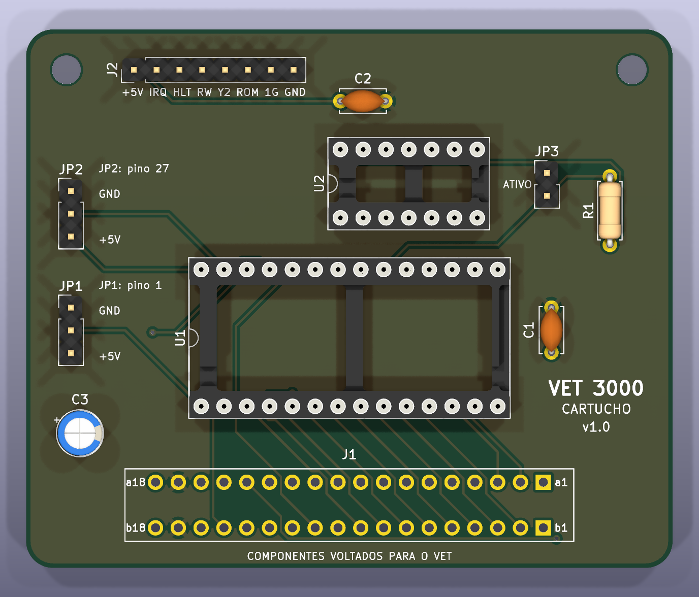
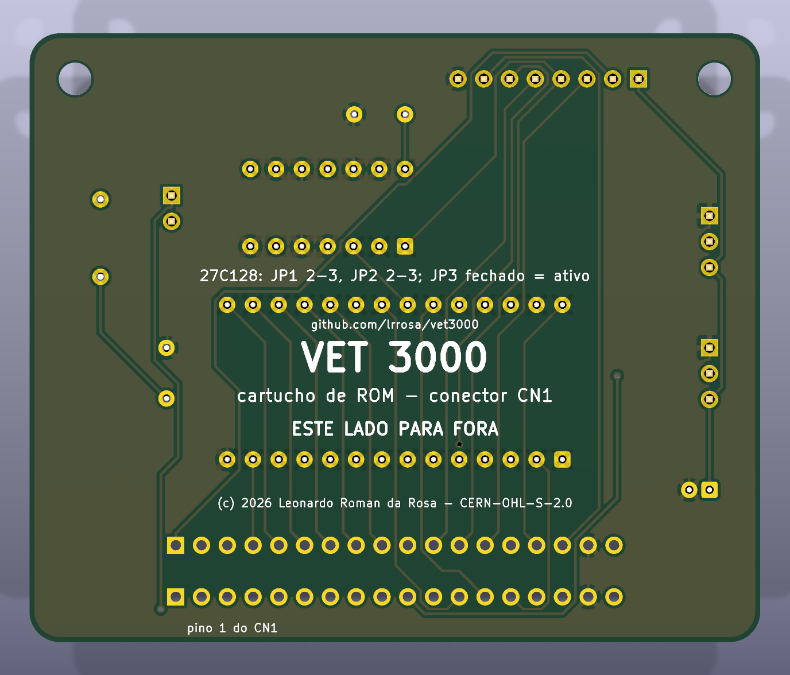
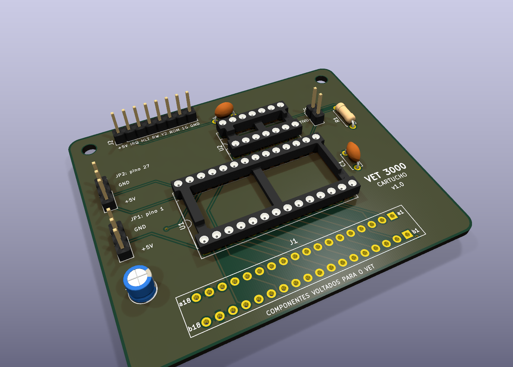

# Cartucho de ROM para o VET 3000 (KiCad)

Projeto KiCad 10 do cartucho que encaixa no conector traseiro **CN1** do VET 3000 e roda a
[demo](../../cartridge/demo/) (ou qualquer programa com cabeçalho `"OBJECT"`/`"FONT"`).

Copyright © 2026 Leonardo Roman da Rosa. Hardware aberto sob a **CERN-OHL-S-2.0** (ver
[Licença](#licença)).

| Frente (componentes, voltada para o VET) | Verso (fica à vista) | 3D |
|---|---|---|
|  |  |  |

## Arquivos

| Arquivo | Conteúdo |
|---|---|
| `vet3000_cartucho.kicad_pro/.kicad_sch/.kicad_pcb` | Projeto KiCad (esquemático, placa roteada) |
| `vet3000.pretty/` | Footprint do soquete de borda 2×18 (gerado por `gen/gen_footprint.py`) |
| `fabricacao/vet3000_cartucho_gerbers.zip` | Gerbers + furação para enviar à fábrica |
| `fabricacao/vet3000_cartucho_esquematico.pdf` | Esquemático em PDF |
| `fabricacao/vet3000_cartucho_bom.csv` | Lista de materiais |
| `gen/` | Scripts que geram tudo (ver "Regenerar") |

Verificação: ERC sem violações; DRC sem violações, sem pads desconectados e com paridade
esquemático↔placa (`kicad-cli pcb drc --schematic-parity`). Placa de 2 camadas, 72 × 60 mm, trilhas
de 0,25 mm (sinais) e 0,6 mm (alimentação), isolação de 0,2 mm, planos de GND nas duas faces.
Roteada com o Freerouting.

## Circuito

- **J1**: soquete fêmea de borda 2×18 que encaixa nos dedos do CN1. A fileira **a** toca os
  contatos de cima do CN1 (face de componentes do VET: IRQ, D0-D7, seleções, R/W, HALT, +5V, GND);
  a fileira **b** toca os de baixo (A0-A13, GND). **b1 (+3 V da bateria) e b16 (−5 V) não são
  ligados.**
- **U1**: EPROM 27C128 (16 KB) em soquete. `/CE` = seleção **Y1** do VET (`$4000-$7FFF`, contato
  a14), passando pelo jumper **JP3**.
- **U2**: 74HCT00 fazendo `/OE = NÃO(R/W)`: a EPROM só coloca dados no barramento em leituras, e
  uma escrita por engano em `$4000-$7FFF` não causa conflito. As outras três portas ficam com as
  entradas no GND.
- **R1** (10k): mantém `/CE` em 1 com o JP3 aberto.
- **J2 (EXP)**: +5V, IRQ, HALT, R/W, Y2 (`$8000-$BFFF`), E da ROM interna, 1G e GND, para
  experiências (E/S externa, depuração).

## Jumpers

| Memória | JP1 (pino 1) | JP2 (pino 27) |
|---|---|---|
| **27C128** (padrão) | 2-3 (VPP = +5 V) | 2-3 (/PGM = +5 V) |
| 27C256 | 2-3 (VPP = +5 V) | A14: 1-2 = metade de baixo, 2-3 = metade de cima |
| W27C512 / 27C512 | A15 | A14 (juntos escolhem um de 4 bancos de 16 KB) |
| 28C256 (EEPROM) | A14: escolhe a metade | 2-3 (/WE = +5 V, nunca escreve) |

**JP3 fechado** = cartucho ativo. **Aberto** = o VET não enxerga o cartucho e liga direto no
titulador. Com a demo dá para fazer o mesmo sem mexer no jumper: segure EXT MODE ao ligar.

Para gravar: a imagem `cartridge/demo/vet3000_demo.bin` tem 16 KB e vai direto na 27C128. Numa
27C256/27C512, grave-a na metade ou banco escolhido pelos jumpers (ex.: duplicada nas duas metades).

## Montagem mecânica

O CN1 do VET são **dedos de borda** na própria placa principal (macho). O cartucho usa um
**soquete fêmea reto**, e a placa fica **em pé atrás do aparelho, com os componentes voltados
para o VET**. Assim, olhando o VET por trás, o pino 1 fica à esquerda, como na medida original.
Na serigrafia: "COMPONENTES VOLTADOS PARA O VET" na frente e "ESTE LADO PARA FORA" no verso.

## Antes de mandar fabricar

- **Passo dos dedos do CN1: 2,54 mm (0,1"), medido** no aparelho. É o passo do footprint.
- **Soquete:** o footprint supõe soquete de 0,1" com terminais em duas fileiras a **5,08 mm**
  (0,2"), como o Sullins EBC18DCxN. Confira no datasheet do soquete comprado.
- **Espaço atrás do VET:** a abertura do painel, o comprimento dos dedos para fora e se a placa
  de 72 × 60 mm em pé não bate em nada.
- Opcional: com ponta lógica, confirmar que o contato a14 (Y1) só vai a 0 nos acessos a
  `$4000-$7FFF`.

Se o soquete tiver outra distância entre fileiras, gere o footprint com a medida certa
(`python gen/gen_footprint.py 2.54 3.56`, por exemplo), recrie a placa e roteie de novo (abaixo).

## Lista de materiais

| Ref. | Peça |
|---|---|
| J1 | Soquete de borda fêmea 0,1", 2×18 (36 vias), terminais para PCI |
| U1 | EPROM 27C128 (ou 27C256, W27C512, 28C256) + soquete DIP-28 600 mil |
| U2 | 74HCT00 + soquete DIP-14 |
| C1, C2 | 100 nF cerâmico, passo 5 mm |
| C3 | 10 µF 16 V eletrolítico, Ø5 mm, passo 2 mm |
| R1 | 10 kΩ 1/4 W |
| JP1, JP2 | Barra de pinos 1×3 + jumper |
| JP3 | Barra de pinos 1×2 + jumper |
| J2 | Barra de pinos 1×8 (opcional) |

Placa: 2 camadas, FR-4 1,6 mm, 72 × 60 mm, furos de 1,0 mm (pads) e 0,4 mm (vias), 2 furos M3.

## Regenerar

Os scripts em `gen/` geram o projeto do zero. Rode-os a partir desta pasta:

```bash
python gen/gen_footprint.py            # footprint do soquete (passo e fileiras como argumentos)
python gen/gen_project.py              # .kicad_pro (classes de rede) e fp-lib-table
python gen/gen_schematic.py            # esquemático
kicad-cli sch erc vet3000_cartucho.kicad_sch
kicad-cli sch export netlist --format kicadsexpr -o vet3000_cartucho.net vet3000_cartucho.kicad_sch
"C:/Program Files/KiCad/10.0/bin/python.exe" gen/gen_pcb.py   # ATENÇÃO: recria a placa sem trilhas
```

Roteamento (caminhos **sem espaços** para o Freerouting):

```bash
PY="C:/Program Files/KiCad/10.0/bin/python.exe"; W=C:/Temp/fr
"$PY" gen/route.py decoy vet3000_cartucho.kicad_pcb $W/isca.kicad_pcb   # sem zonas, borda recuada
"$PY" gen/route.py export $W/isca.kicad_pcb $W/rota.dsn
"$PY" gen/route.py tweak $W/rota.dsn 250 600 200   # sinais 0,25, +5V/GND 0,6, isolação 0,2 mm
freerouting.exe -de $W/rota.dsn -do $W/rota.ses -mp 300 -mt 1
"$PY" gen/route.py import vet3000_cartucho.kicad_pcb $W/rota.ses    # trilhas + preenche zonas
kicad-cli pcb drc --schematic-parity --severity-all vet3000_cartucho.kicad_pcb
```

A etapa `tweak` move +5V e GND para uma classe "power" mais larga no DSN, com as mesmas regras
do `.kicad_pro`.

Fabricação:

```bash
kicad-cli pcb export gerbers --layers "F.Cu,B.Cu,F.SilkS,B.SilkS,F.Mask,B.Mask,Edge.Cuts" --subtract-soldermask -o fabricacao/gerbers/ vet3000_cartucho.kicad_pcb
kicad-cli pcb export drill --format excellon --drill-origin absolute --excellon-units mm --generate-map --map-format gerberx2 -o fabricacao/gerbers/ vet3000_cartucho.kicad_pcb
```

## Licença

Copyright © 2026 Leonardo Roman da Rosa.

Esta fonte descreve Hardware Aberto e é licenciada sob a CERN-OHL-S v2 ([LICENSE](LICENSE)). Você
pode redistribuir e modificar esta fonte e fabricar produtos com ela nos termos da CERN-OHL-S v2
(https://ohwr.org/cern_ohl_s_v2.txt).

Esta fonte é distribuída SEM QUALQUER GARANTIA EXPRESSA OU IMPLÍCITA, INCLUSIVE DE
COMERCIABILIDADE, QUALIDADE SATISFATÓRIA E ADEQUAÇÃO A UM FIM ESPECÍFICO. Veja as condições
aplicáveis na CERN-OHL-S v2.

Source location: https://github.com/lrrosa/vet3000

Conforme a seção 4 da CERN-OHL-S v2, quem fabricar hardware a partir desta fonte deve, quando
possível, manter o Source Location visível no exterior do produto. A serigrafia do verso da placa
já traz o endereço.

A licença vale para tudo nesta pasta: esquemático, placa, footprint, arquivos de fabricação e os
scripts de `gen/`, que são a fonte do projeto. O restante do repositório (ferramentas, disassembly
e o software da demo) segue sob a GPL-3.0-or-later.
