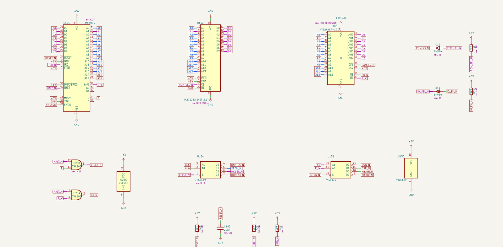
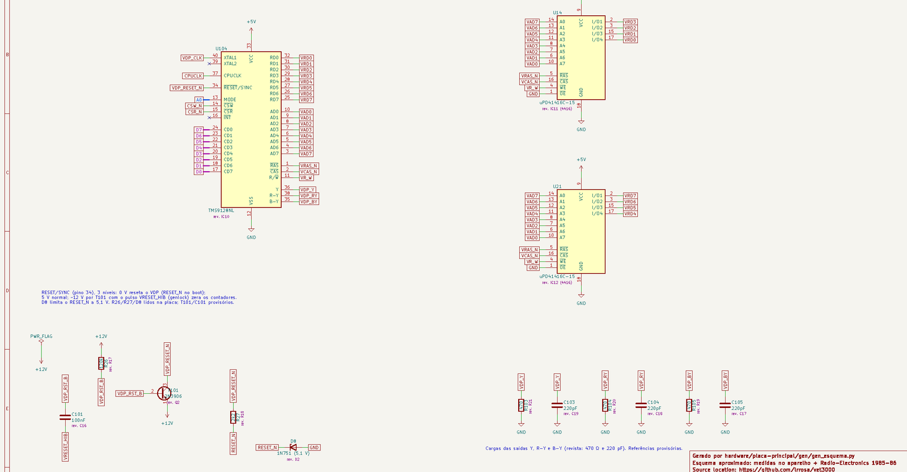

# Placa principal do VET 3000: esquema aproximado (KiCad)

Esquema da placa principal `VET 30 VS1 REV. 2` em KiCad 10. O circuito junta duas fontes:

- as **medidas de continuidade** feitas no aparelho ([CN1](../../docs/conector-cn1.md),
  [teclado](../../docs/teclado.md), U19, `/INT`) e as referências e valores lidos nas
  [fotos](../../photos/);
- o **"Build This Video Titler"** da *Radio-Electronics* (dezembro de 1985 e janeiro de 1986), de
  onde o VET deriva ([origem.md](../../docs/origem.md)).

Esta primeira versão cobre a **parte digital**: CPU, memórias, decodificação, VDP e VRAM, teclado e
CN1. A parte analógica (PLL do clock, sincronismo, croma e mixer) aparece como um bloco com os sinais
que cruzam a fronteira.

Copyright © 2026 Leonardo Roman da Rosa. Hardware aberto sob a **CERN-OHL-S-2.0** (ver
[Licença](#licença)).

| CPU, memórias e decodificação | VDP e VRAM |
|---|---|
|  |  |

## Arquivos

| Arquivo | Conteúdo |
|---|---|
| `vet3000_placa.kicad_pro/.kicad_sch` | Projeto e folha raiz (visão geral, legenda, notas) |
| `cpu.kicad_sch` | 6809, EPROM, RAM, 74LS139, 74LS00, OU com diodos de ROM SEL e I/O SEL, reset |
| `video.kicad_sch` | TMS9128, duas µPD41416, RESET/SYNC de 3 níveis, cargas das saídas Y/R-Y/B-Y |
| `teclado.kicad_sch` | 74LS273, 74LS244, pull-ups e conector das membranas |
| `conectores.kicad_sch` | CN1, alimentação e desacoplamento |
| `analogico.kicad_sch` | Bloco provisório da parte analógica |
| `vet3000_placa.kicad_sym` | Símbolos próprios: TMS9128, µPD41416, `+3V_BAT` e o bloco analógico |
| `vet3000_placa.pdf` | O esquema em PDF |
| [`continuidade.md`](continuidade.md) | Roteiro de continuidade: cada rede, pino a pino, marcada como medida ou a medir |
| `gen/gen_esquema.py` | Gera tudo acima (ver [Regenerar](#regenerar)) |

ERC sem violações. Dois avisos ficam desligados no projeto enquanto a parte analógica não existe:
unidades não posicionadas e pinos de entrada em unidades não posicionadas (portas b e c do U23).

## Como ler

- **Cores das redes.** Azul: todas as ligações da rede foram medidas no aparelho. Roxo: parte delas
  foi medida, o resto segue a revista. Cor padrão do KiCad (rótulo vermelho-escuro, fio fino): só
  segundo a revista, ainda a medir. As cores vêm das classes de rede `Medido` e `Parcial` do projeto.
- **Rótulos.** Toda rede é ligada por rótulos globais, inclusive as internas a uma folha. A
  alimentação usa símbolos nos pinos de cima e de baixo e rótulos (`+5V`, `GND`) nos pinos laterais.
- **Referências.** U14, U15, U16, U21, U22, U23, D8, D10, D11, R26-R30, R48, R49 e R52-R59 foram
  lidas na placa. **U101-U104** (6809, EPROM, RAM, VDP), **T101**, **C101-C114**, **R103-R105**,
  **CN2** e **#BLK1** são provisórias: as referências da placa não aparecem nas fotos. Na placa ainda
  não foram localizados U5, U6, U11, U12 e U18, e entre eles devem estar esses quatro CIs e o LM1889.
  Já identificados na parte analógica: U1 = MC4024, U7 = MC4044, T4 = transistor do PLL.
- **Campo "rev."** Cada peça mostra o equivalente na revista (por exemplo, U15 = IC18).

## Medido e a verificar

O roteiro completo está em [continuidade.md](continuidade.md): 14 redes totalmente medidas, 15
parcialmente e 54 só da revista. Pontos que mais pedem conferência:

1. **Pinos de U16 (74LS273) e U22 (74LS244).** O esquema usa a pinagem da revista. A ordem dos bits
   vista pelo software foi medida pelo lado do teclado, mas a placa foi redesenhada e pode trocar os
   pinos.
2. **Conector do teclado (CN2).** Qual fileira é de qual membrana, e a ordem de R52-R59.
3. **R29 e R30 (4k7).** Um é o pull-up do `/HALT` e o outro o do `/IRQ`, mas não se sabe qual é qual.
4. **D10/R48 e D11/R49.** A atribuição à ROM (D10/R48) e à E/S (D11/R49) segue a posição na placa.
   O CN1 a11 foi medido no pino 6 do U15, antes do diodo; na revista a porta usava o pino 15.
5. **`/OE` da EPROM** no GND e **`/OE` da RAM** pela porta NAND do U23 (`/HALT` com `R/W`).
6. **U14 e U21.** Qual DRAM recebe RD0-RD3 e qual recebe RD4-RD7.
7. **Reset.** R28 (5k1) com um eletrolítico de 22 µF (C102, provavelmente o "C2?" ao lado do D8);
   T101 e C101 do RESET/SYNC do VDP.
8. **Desacoplamento.** Valores e posições da revista.

Já confirmados: todo o barramento de endereços e de dados entre CPU, EPROM, RAM, VDP e CN1, as
seleções do 74LS139 que chegam ao CN1 e a ausência de ligação entre o `/INT` do VDP e o `/IRQ` do
6809.

## Próximos passos

- medir as ligações marcadas com `·` no roteiro e atualizar `MEASURED` em `gen/gen_esquema.py`;
- desenhar a parte analógica a partir das Figs. 7, 8, 11 e 13 da revista, com U1, U7, T4, U19
  (CA3126) e os demais já identificados;
- localizar as referências que faltam (U5, U6, U11, U12, U18 e os passivos do reset e do vídeo).

## Regenerar

```bash
python gen/gen_esquema.py
kicad-cli sch erc --severity-all vet3000_placa.kicad_sch
kicad-cli sch export pdf -o vet3000_placa.pdf vet3000_placa.kicad_sch
```

O script recria as folhas, a biblioteca de símbolos, o `.kicad_pro` (a partir do modelo do KiCad) e
o `continuidade.md`. Alterações feitas à mão no KiCad são perdidas: mude as tabelas do script.

## Licença

Copyright © 2026 Leonardo Roman da Rosa.

Esta fonte descreve Hardware Aberto e é licenciada sob a CERN-OHL-S v2 ([LICENSE](LICENSE)). Você
pode redistribuir e modificar esta fonte e fabricar produtos com ela nos termos da CERN-OHL-S v2
(https://ohwr.org/cern_ohl_s_v2.txt).

Esta fonte é distribuída SEM QUALQUER GARANTIA EXPRESSA OU IMPLÍCITA, INCLUSIVE DE
COMERCIABILIDADE, QUALIDADE SATISFATÓRIA E ADEQUAÇÃO A UM FIM ESPECÍFICO. Veja as condições
aplicáveis na CERN-OHL-S v2.

Source location: https://github.com/lrrosa/vet3000

A licença vale para os arquivos desta pasta: o desenho do esquema, a biblioteca de símbolos, o
roteiro de continuidade e os scripts de `gen/`. O circuito documentado é o do VET 3000 (TMS) e do
projeto de Jack Flack publicado na *Radio-Electronics*, e esta licença não concede direitos sobre
eles.
